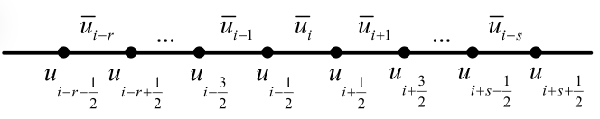
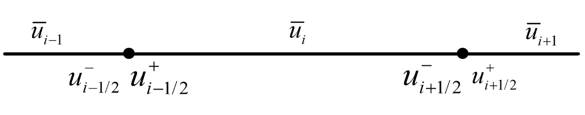

# WENO-the spatially high order non-oscillatory scheme
## Reconstruct cell boundaries from cell average
The first step is to use cell average values

$$\bar{u}_i=\frac{1}{\Delta x}\int_{x-1/2}^{x+1/2}u(x)dx，$$

to approximate the half-grid points $u(x_{i+1/2}^+)$ and $u(x_{i+1/2}^-)$.
The superscripts $+/-$ is omitted for simplicity.

We want to find polynomials $p(x)$ which satisfies 
1. $\int_{x_{j-1/2}}^{x_{j+1/2}}p(x)dx=\bar{u}_j$,
2. $p(x)=u(x)+O(\Delta x^k).$

So that we have 

$$u(x_{i+1/2})= p(x_{i+1/2}) + O(\Delta x^k)=\sum_{i}c_i\bar{u}_i + O(\Delta x^k).$$

We can define the primitive function of $u(x)$ as
$U(x)=\int_{x_{-1/2}}^xu(\xi)d\xi$, so that

$$U(x_{i+1/2})=\int_{x_{-1/2}}^{x_{i+1/2}}u(\xi)d\xi=\sum_{l=0}^i\Delta x\bar{u}_l.$$

If we could construct the Lagrange interpolation polynomial of $U(x)$ as $P(x)$, then we obtain $p(x)$ by taking the derivative of $P(x)$.




Given stencil $S(i)=\{I_{i-r},\cdots,I_{i+s}\}$, where $r+s+1=k$, we can use $k+1$ cell boundaries to construct the $k$-th order Lagrange interpolation polynomial

$$P(x)=\sum_{m=0}^kU(x_{i-r+m-1/2})\prod_{l=0,l\neq m}^{k}\frac{x-x_{i-r+l-1/2}}{x_{i-r+m-1/2}-x_{i-r+l-1/2}}.$$

Subtract $U(x_{i-r-1/2})$ from both sides, we have

$$P(x)-U(x_{i-r-1/2})=\sum_{m=0}^k\left (U(x_{i-r+m-1/2})-U(x_{i-r-1/2})\right)\prod_{l=0,l\neq m}^{k}\frac{x-x_{i-r+l-1/2}}{x_{i-r+m-1/2}-x_{i-r+l-1/2}}.$$

Take the first order derivatives of both sides, we have

$$p(x)=\sum_{m=0}^k\sum_{j=0}^{m-1}\left(\bar{u}_{i-r+j}\Delta x_{i-r+j}\right)\frac{\sum_{l=0,l\neq m}^{k}\prod_{q=0,q\neq m,l}^{k}\left(x-x_{i-r+q-1/2}\right)}{\prod_{l=0,l\neq m}^{k}\left(x_{i-r+m-1/2}-x_{i-r+l-1/2}\right)},$$

since 

$$U(x_{i-r+m-1/2})-U(x_{i-r-1/2})=\sum_{j=0}^{m-1}\bar{u}_{i-r+j}\Delta x_{i-r+j}.$$

For uniform grid, if we view $r$ and $k$ as variables, we obtain

$$p(x, r,k)=\sum_{m=0}^k\sum_{j=0}^{m-1}\bar{u}_{i-r+j}\frac{\sum_{l=0,l\neq m}^{k}\prod_{q=0,q\neq m,l}^{k}\left(r-q+1\right)}{\prod_{l=0,l\neq m}^{k}\left(m-l\right)}.$$

Finally, we have

$$u_{i+1/2}^{(r)}=p(x_{i+1/2},r,k),$$

and

$$u_{i-1/2}^{(r)}=p(x_{i-1/2},r,k).$$

Below is the sympy codes for the above reconstruction
```python
import sympy as sp
def px(idx, r, k):
  """
  idx: subscript of u
  r: left start of stencil
  k: points in stencil
  return: reconstruction of u[idx] based on u[i-r], ..., u[i], ..., u[i-r+k-1]
  """
  i = sp.symbols('i')
  u=sp.IndexedBase('u')
  px=0
  for m in range(k+1):
    for j in range(m):
      if j-r>0:
        ubar=u[sp.Idx(f'i+{j-r}')]
      elif j-r<0:
        ubar=u[sp.Idx(f'i-{-j+r}')]
      else:
        ubar=u['i']
      numer=sp.Add(*[sp.Mul(*[idx-(i-r+q-sp.Rational(1/2)) for q in range(k+1) if q not in [l,m]]) for l in range(k+1) if l!=m])
      denom=sp.Mul(*[(m-l) for l in range(k+1) if l!=m])
      px=px+ubar*numer/denom
  return px.expand()
```

```python
>>> i=sp.symbols('i')
>>> px(i+sp.Rational(1/2), 2, 3)
-7*u[i-1]/6 + u[i-2]/3 + 11*u[i]/6
```

It suffices to show that $\int_{x_{j-1/2}}^{x_{j+1/2}}p(x)dx=\bar{u_j}$ and $p(x)=u(x)+O(\Delta x^k)$.

We have

$$\begin{aligned}
\frac{1}{\Delta x_j} \int_{x_{j-\frac{1}{2}}}^{x_{j+\frac{1}{2}}} p(\xi) d \xi & =\frac{1}{\Delta x_j} \int_{x_{j-\frac{1}{2}}}^{x_{j+\frac{1}{2}}} P^{\prime}(\xi) d \xi=\frac{1}{\Delta x_j}\left(P\left(x_{j+\frac{1}{2}}\right)-P\left(x_{j-\frac{1}{2}}\right)\right) \\
& =\frac{1}{\Delta x_j}\left(U\left(x_{j+\frac{1}{2}}\right)-U\left(x_{j-\frac{1}{2}}\right)\right) \\
& =\frac{1}{\Delta x_j}\left(\int_{-\infty}^{x_{j+\frac{1}{2}}} u(\xi) d \xi-\int_{-\infty}^{x_{j-\frac{1}{2}}} u(\xi) d \xi\right) \\
& =\frac{1}{\Delta x_j} \int_{x_{j-\frac{1}{2}}}^{x_{j+\frac{1}{2}}} u(\xi) d \xi=\bar{u}_j, \quad j=i-r, \ldots, i+s,
\end{aligned}$$

where the third equality holds since $P(x)$ interpolates $U(x)$ at the points $x_{j-1/2}$ and $x_{j+1/2}$. 

Because $P(x)=U(x)+O(\Delta x^{k+1})$，one can find in any elementary numerical analysis book that

$$p(x) = u(x)+\left(\frac{f^{(n+1)}(\xi(x))}{(n+1)!}\prod_{i=0}^{n}(x-x_i)\right)'=u(x)+O(\Delta x^k).$$

## ENO
The method uses the Newton divided difference to measure the smoothness of stencil. This is based on the property that in non-smooth stencil,

$$U[x_{i-1/2},\cdots,x_{i+j-1/2}]=\mathcal{O}\left(\frac{1}{\Delta x^j}\right),$$ 

which can easily verified.


## From ENO to weighted ENO (WENO)
ENO dependent on $k$ nodes is of $O(\Delta x^k)$ at most. Moreover, we have to change the stencil in each step based on the smoothness measurement.

WENO is the weighted average of $k$ ENO scheme. It uses $2k-1$ nodes so that it achieves $O(\Delta x^{2k-1})$. Also, the stencil is fixed.


### WENO Schemes

#### $k=3$
$$u_{i+1 / 2}^{(0)}=\frac{1}{3}\bar{u}_i+\frac{5}{6} \bar{u}_{i+1}-\frac{1}{6}\bar{u}_{i+2}$$
$$u_{i+1 / 2}^{(1)}=-\frac{1}{6} \bar{u}_{i-1}+\frac{5}{6} \bar{u}_i+\frac{1}{3} \bar{u}_{i+1}$$
$$u_{i+1/2}^{(2)}=\frac{1}{3}\bar{u}_{i-2}-\frac{7}{6}\bar{u}_{i-1}+\frac{11}{6}\bar{u}_{i}$$
$$\gamma_0=\frac{3}{10}, \quad \gamma_1=\frac{3}{5}, \quad \gamma_2=\frac{1}{10}$$
$$\begin{aligned}
& \beta_0=\frac{13}{12}\left(\bar{u}_i-2 \bar{u}_{i+1}+\bar{u}_{i+2}\right)^2+\frac{1}{4}\left(3 \bar{u}_i-4 \bar{u}_{i+1}+\bar{u}_{i+2}\right)^2, \\
& \beta_1=\frac{13}{12}\left(\bar{u}_{i-1}-2 \bar{u}_i+\bar{u}_{i+1}\right)^2+\frac{1}{4}\left(\bar{u}_{i-1}-\bar{u}_{i+1}\right)^2, \\
&  \beta_2=\frac{13}{12}\left(\bar{u}_{i-2}-2 \bar{u}_{i-1}+\bar{u}_i\right)^2+\frac{1}{4}\left(\bar{u}_{i-2}-4 \bar{u}_{i-1}+3 \bar{u}_i\right)^2.
\end{aligned}$$
$$\omega_j=\frac{\alpha_j}{\alpha_0+\alpha_1+\alpha_2}, \quad \alpha_j=\frac{\gamma_j}{\left(\epsilon+\beta_j\right)^2}, \quad j=0,1,2 .$$
$$u_{i+1 / 2}^-=\omega_0 u_{i+1 / 2}^{(0)}+\omega_1 u_{i+1 / 2}^{(1)}+\omega_2 u_{i+1 / 2}^{(2)}$$

$$u_{i-1 / 2}^{(0)}=\frac{11 {u}_{i}}{6}- \frac{7 {u}_{i+1}}{6} + \frac{{u}_{i+2}}{3}$$
$$u_{i-1 / 2}^{(1)}= \frac{{u}_{i-1}}{3} + \frac{5 {u}_{i}}{6}- \frac{{u}_{i+1}}{6}$$
$$u_{i-1/2}^{(2)}=- \frac{{u}_{i-2}}{6}+\frac{5 {u}_{i-1}}{6}  + \frac{{u}_{i}}{3}$$
$$\tilde{\gamma}_0=\gamma_2=\frac{1}{10},\quad\tilde{\gamma}_1=\gamma_1=\frac{3}{5},\quad\tilde{\gamma}_2=\gamma_0=\frac{3}{10}$$
$$\tilde{\omega}_j=\frac{\tilde{\alpha}_j}{\tilde{\alpha}_0+\tilde{\alpha}_1+\tilde{\alpha}_2}, \quad \tilde{\alpha}_j=\frac{\tilde{\gamma}_j}{\left(\epsilon+\beta_j\right)^2}, \quad j=0,1,2 .$$
$$u_{i-1 / 2}^+=\tilde{\omega}_0 u_{i-1 / 2}^{(0)}+\tilde{\omega}_1 u_{i-1 / 2}^{(1)}+\tilde{\omega}_2 u_{i-1 / 2}^{(2)}$$

It should be verified that

 $$\gamma_0 u_{i+1 / 2}^{(0)}+\gamma_1 u_{i+1 / 2}^{(1)}+\gamma_2 u_{i+1 / 2}^{(2)}=p(x_{i+1/2},2,5)$$

 and

 $$\tilde{\gamma}_0 u_{i-1 / 2}^{(0)}+\tilde{\gamma}_1 u_{i-1 / 2}^{(1)}+\tilde{\gamma}_2 u_{i-1 / 2}^{(2)}=p(x_{i-1/2},2,5),$$

only in which case the left hand side is the $O(\Delta x^5)$ approximations of $u(x_{i+1/2})$ and $u(x_{i+1/2})$ 

#### $k=2$
$$u_{i+1 / 2}^{(0)}=\frac{{u}_{i}}{2}+\frac{{u}_{i+1}}{2}$$
$$u_{i+1 / 2}^{(1)}=- \frac{{u}_{i-1}}{2} + \frac{3 {u}_{i}}{2}$$
$$\gamma_0=\frac{2}{3}, \quad \gamma_1=\frac{1}{3}$$
$$\begin{aligned}
& \beta_0=\left(\bar{u}_{i+1}-\bar{u}_{i}\right)^2, \\
& \beta_1=\left(\bar{u}_{i}-\bar{u}_{i-1}\right)^2.
\end{aligned}$$
$$\omega_j=\frac{\alpha_j}{\alpha_0+\alpha_1}, \quad \alpha_j=\frac{\gamma_j}{\left(\epsilon+\beta_j\right)^2}, \quad j=0,1.$$
$$u_{i+1 / 2}^-=\omega_0 u_{i+1 / 2}^{(0)}+\omega_1 u_{i+1 / 2}^{(1)}$$

$$u_{i-1 / 2}^{(0)}=\frac{3 {u}_{i}}{2}- \frac{{u}_{i+1}}{2}$$
$$u_{i-1 / 2}^{(1)}= \frac{{u}_{i-1}}{2} + \frac{{u}_{i}}{2}$$
$$\tilde{\gamma}_0=\gamma_1=\frac{1}{3},\quad\tilde{\gamma}_1=\gamma_0=\frac{2}{3}$$
$$\tilde{\omega}_j=\frac{\tilde{\alpha}_j}{\tilde{\alpha}_0+\tilde{\alpha}_1}, \quad \tilde{\alpha}_j=\frac{\tilde{\gamma}_j}{\left(\epsilon+\beta_j\right)^2}, \quad j=0,1 .$$
$$u_{i-1 / 2}^+=\tilde{\omega}_0 u_{i-1 / 2}^{(0)}+\tilde{\omega}_1 u_{i-1 / 2}^{(1)}$$

It should be verified that

$$\gamma_0 u_{i+1 / 2}^{(0)}+\gamma_1 u_{i+1 / 2}^{(1)}=p(x_{i+1/2},1,2*2-1)$$

and

$$\tilde{\gamma}_0 u_{i-1 / 2}^{(0)}+\tilde{\gamma}_1 u_{i-1 / 2}^{(1)}=p(x_{i-1/2},1,3),$$

only in which case the left hand side is the $O(\Delta x^3)$ approximation of $u(x_{i+1/2})$ and $u(x_{i+1/2})$.

### WENO in finite volume
For PDE,

$$u_t(x,t)+f_x(u(x,t))=0.$$



It can be transformed as

$$\frac{\mathrm{d}\bar{u}_i(t)}{\mathrm{d}t}=-\frac{1}{\Delta x_i}\left(\hat{f}_{i+1/2}-\hat{f}_{i-1/2}\right)$$

where

$$\hat{f}_{i+1/2}=h\left(u_{i+1/2}^-,u_{i+1/2}^+\right)$$

and
$h$ is the monotone flux, which has two types: 
1. the Godunov type (for low order computation)

$$h(a,b)=\begin{cases}\min_{a\leq u\leq b}f(u)\quad a\leq b\\
\max_{a\leq u\leq b}f(u)\quad a>b
\end{cases}$$

2. the Lax-Friedrichs type (for high order computation) 

$$h(a,b)=\frac{1}{2}[f(a)+f(b)-\max_u|f'(u)|(b-a)]$$

### WENO in finite difference
Similarly, we have

$$\frac{\mathrm{d}u_i(t)}{\mathrm{d}t}=-\frac{1}{\Delta x_i}\left(\hat{f}_{i+1/2}-\hat{f}_{i-1/2}\right).$$

The flux is split into 

$$f(u)=f^+(u)+f^-(u)$$

where

$$\frac{\mathrm{d}f^+(u)}{\mathrm{d}u}\geq 0,\quad \frac{\mathrm{d}f^-(u)}{\mathrm{d}u}\leq 0.$$

For example, using the above Lax-Friedrichs splitting derives

$$f^+(u)=\frac{1}{2}\left(f(u)+\alpha u\right),$$

and

$$f^-(u)=\frac{1}{2}\left(f(u)-\alpha u\right).$$

Identify $\bar{u}_i=f^+(u_i)$, then use WENO to reconstruct $\hat{f}^+_{i+1/2}=u_{i+1/2}^-$ with $\bar{u}_i$s.

Identify $\bar{u}_i=f^-(u_i)$, then use WENO to reconstruct $\hat{f}^-_{i+1/2}=u_{i+1/2}^+$ with $\bar{u}_i$s.

Finally, we have

$$\hat{f}_{i+1/2}=\hat{f}_{i+1/2}^++\hat{f}_{i+1/2}^-.$$

FVM and FDM are equivalent in the case of linear, constant coefficient 1D PDE.
### The Boundary conditions
The types of boundary conditions can be classified into

1. periodic
2. reflective/symmetry
3. inflow/partially inflow 

For 1 and 2, we could set ghost points and prescribe values for them using periodicity condition, symmetry/anti-symmetry properties.
For 3, we could **use only the available values inside the computational domain** when choosing the stencil or **use extrapolation** of suitable order to set the values of the solution in all necessary ghost points

## Reference
[Shu-WENO-notes.pdf](https://www3.nd.edu/~zxu2/acms60790S13/Shu-WENO-notes.pdf)

### Implementations
[PyWENO — PyWENO 0.11.2 documentation](https://pyweno.readthedocs.io/en/latest/index.html) Reconstruction of cell boundaries.

[Weighted Essentially Non-Oscillatory (WENO) Scheme for Euler](https://uk.mathworks.com/matlabcentral/fileexchange/56905-weighted-essentially-non-oscillatory-weno-scheme-for-euler) Matlab codes for WENO of the Euler equations.

[GitHub - WENO-OF/WENOEXT: Weighted essentially non-oscillatory library for the framework of OpenFOAM](https://github.com/WENO-OF/WENOEXT)

[GitHub - usnistgov/fipy: FiPy is a Finite Volume PDE solver written in Python](https://github.com/usnistgov/fipy)

